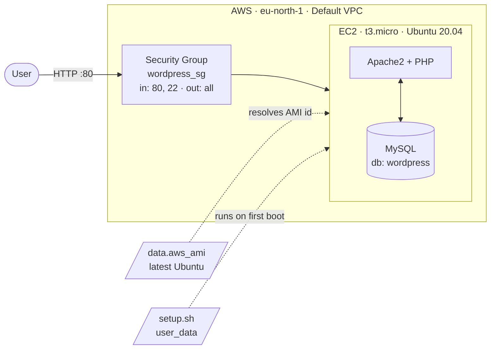

# Project 1: Deploy WordPress Using Terraform

Deploys a complete, publicly reachable WordPress site on AWS using nothing but `terraform apply`.
The instance boots, installs a LAMP stack, configures a database, downloads WordPress and wires up
`wp-config.php`, with no manual steps and no SSH session.

**Result:** a working WordPress installation at `http://<public-ip>`, ready for the five-minute
install.

---

## What I built

A single-instance WordPress stack in AWS, provisioned entirely as code:

- **EC2 instance** (`t3.micro`, Ubuntu 20.04 LTS) running the full stack
- **Security group** allowing HTTP (80) and SSH (22) inbound, all traffic outbound
- **Dynamic AMI lookup** so the latest Canonical Ubuntu image is always used, with no hardcoded
  AMI IDs that break across regions
- **`user_data` bootstrap script** (`setup.sh`) that installs and configures Apache, MySQL, PHP
  and WordPress on first boot
- **Outputs** exposing the public IP and a click-ready URL

### Architecture



Terraform creates the security group, launches the EC2 instance with `setup.sh` as `user_data`,
then cloud-init runs that script as root on first boot and Apache serves WordPress on port 80.

---

## How the Terraform code is structured

Split by responsibility rather than dumped in one file:

| File | Responsibility |
|------|----------------|
| `provider.tf` | AWS provider, pinned to `6.55.0`, region from a variable |
| `main.tf` | The infrastructure: AMI data source, security group, EC2 instance |
| `variables.tf` | Inputs: `aws_region`, `instance_type`, both with defaults |
| `outputs.tf` | The public IP and the full site URL |
| `setup.sh` | The bootstrap script, referenced by `user_data` rather than inlined |
| `.terraform.lock.hcl` | Locks provider hashes so `init` is reproducible on any machine |

### provider.tf

```hcl
required_providers {
  aws = {
    source  = "hashicorp/aws"
    version = "6.55.0"
  }
}
```

Pinning to an exact version means a provider release can't silently change behaviour under me.
The lock file is committed for the same reason.

### main.tf

**1. AMI data source.** Looks the image up at plan time instead of hardcoding an ID:

```hcl
data "aws_ami" "Ubuntu" {
  most_recent = true
  owners      = ["099720109477"] # Canonical
  filter {
    name   = "name"
    values = ["ubuntu/images/hvm-ssd/ubuntu-focal-20.04-amd64-server-*"]
  }
}
```

AMI IDs are region-specific, so hardcoding one pins the code to a single region and breaks the
moment Canonical publishes a new build. The name filter plus `most_recent` keeps it portable.

**2. Security group.**

```hcl
ingress { from_port = 80, to_port = 80, protocol = "tcp", cidr_blocks = ["0.0.0.0/0"] }
ingress { from_port = 22, to_port = 22, protocol = "tcp", cidr_blocks = ["0.0.0.0/0"] }
egress  { from_port = 0,  to_port = 0,  protocol = "-1",  cidr_blocks = ["0.0.0.0/0"] }
```

Egress is wide open by design. The instance needs it to reach the Ubuntu apt mirrors and
`wordpress.org` during bootstrap.

**3. EC2 instance.** Ties the other two together:

```hcl
resource "aws_instance" "wordpress_server" {
  ami             = data.aws_ami.Ubuntu.id
  instance_type   = var.instance_type
  security_groups = [aws_security_group.wordpress_sg.name]
  user_data       = file("${path.module}/setup.sh")
}
```

There's no explicit `depends_on` anywhere. Referencing `aws_security_group.wordpress_sg.name` is
enough for Terraform to build the dependency graph and create the security group first.

### setup.sh

Runs as root via cloud-init on first boot only:

1. Set `DEBIAN_FRONTEND=noninteractive` so `apt` never blocks on a prompt
2. Wait for the dpkg lock to clear (see Issues below)
3. `apt install` Apache, MySQL, PHP, `php-mysql`, `libapache2-mod-php`
4. Enable and start both services so they survive a reboot
5. Create the `wordpress` database, the `wp_user` account, and grant privileges
6. Download and extract the latest WordPress tarball into `/var/www/html`
7. `chown` to `www-data` and remove Apache's default `index.html`
8. Copy `wp-config-sample.php` to `wp-config.php` and `sed` the DB credentials in
9. Restart Apache to load the PHP module

### outputs.tf

```hcl
output "wordpress_url" {
  value = "http://${aws_instance.wordpress_server.public_ip}"
}
```

Building the URL in the output rather than emitting a bare IP means apply finishes with a link I
can paste straight into a browser.

---

## Deploying it

```bash
cd assignment-1-wordpress

terraform init      # downloads the pinned AWS provider
terraform plan      # review: 2 resources to add
terraform apply     # type 'yes', takes about a minute
```

Then wait 2 to 4 minutes. Terraform reports success the moment the instance is *running*, but
`user_data` is still installing packages in the background. Hitting the URL immediately gives a
connection error. That's expected, not a failure.

```bash
terraform output wordpress_url   # http://16.x.x.x
terraform destroy                # tear it down when finished
```

---

## Screenshots

### 1. terraform apply, with the live URL in the outputs


Apply completes and returns both outputs. `wordpress_url` is built from the instance's public IP
in `outputs.tf`, so the site is one click away with no console lookup.

### 2. The WordPress installer, reached over the public IP


This screen is the real proof that `user_data` worked. WordPress only renders it once Apache is
serving, PHP is parsing, and MySQL is reachable, so all three came up from the bootstrap script
without a single manual step.

### 3. The WordPress admin dashboard


Logged in at `/wp-admin` after finishing the install. This confirms the `wp_user` database
credentials that `sed` wrote into `wp-config.php` actually work, since WordPress can't store an
admin account without a working DB connection.

### 4. The EC2 instance in the AWS console


The instance is `running` in eu-north-1, tagged "WordPress Server Project 1" from the `tags` block
in `main.tf`. Nothing here was clicked into existence.

### 5. The security group rules


The inbound rules Terraform created from the `ingress` blocks: port 80 for the site, port 22 for
SSH. Both open to `0.0.0.0/0`, which is fine for a throwaway assignment box and wrong for anything
real. See Known gaps.

### 6. The cloud-init log that exposed the first failure


From the first deploy, which failed. Read through EC2 Instance Connect on the broken instance.
`Unit apache2.service not found` is the line that cracked it open: Apache was never installed, so
every error below it was a symptom rather than a cause. Full story in Issues below.

### 7. terraform destroy, tearing it back down


Both resources destroyed cleanly. The same state file that created the infrastructure knows how to
remove all of it, which is what keeps a learning account from quietly accruing a bill.

---

## What I learnt

**Terraform builds its own dependency graph.** I expected to sequence resource creation manually.
Referencing `aws_security_group.wordpress_sg.name` inside the instance block is what tells
Terraform the security group must exist first. The graph comes from the references, not the order
of the blocks in the file.

**Data sources decouple code from a region.** Hardcoding an AMI ID would have locked this to one
region and broken on the next Canonical release. `data "aws_ami"` with a name filter solves both,
and it resolves at plan time so I see the real ID before applying.

**"Instance running" is not "application ready".** Terraform's job ends when the EC2 API says the
instance is up, but `user_data` runs for minutes afterwards. That gap is invisible to Terraform.
Understanding it stopped me from debugging a problem that didn't exist.

**`user_data` only runs once.** It fires on first boot, not on every start. Editing `setup.sh` and
re-applying forces a full instance replacement rather than re-running the script.

**Read logs top-down, not bottom-up.** My instinct was to look at the last error, which was the
most downstream one and sent me looking in completely the wrong place. Six failures traced back to
one `Could not get lock` line near the top. The last error is a symptom, the first is the cause.

**Cloud boot is a race, not a sequence.** I assumed my script was the only thing running on a fresh
instance. It isn't. `unattended-upgrades` is already competing for the package manager, so a
bootstrap script has to wait for the environment instead of assuming it's idle.

**Bash fails forward, which is dangerous.** `apt` skipped the entire install and the script carried
on for thirty more lines configuring software that wasn't there. A `set -e` would have stopped at
the real error instead of generating a cascade of noise.

**You can debug an instance with no SSH key.** EC2 Instance Connect gave me a root terminal in the
browser without a key pair configured. Leaving the key out cost me nothing.

**Immutable infrastructure clicked here.** SSHing in and running `apt install` by hand would have
worked in a minute, but that fix would have lived only on that box and vanished on the next
rebuild. Fixing the script and running `taint` plus `apply` put the fix in git, so the next
instance is correct for the same reason this one is.

---

## Issues I hit and how I fixed them

The first deployment failed completely. Terraform reported success, the instance was `running`, and
the site was dead.

### 1. Apply succeeded, WordPress didn't exist

`terraform apply` finished cleanly and the instance was healthy in the console, but the public IP
served nothing. Terraform had done its job. The failure was entirely inside `user_data`, which
Terraform has no visibility into and never reports on.

### 2. Getting into the black box without an SSH key

`user_data` runs unattended during boot. No terminal, no output, no error, just a broken box. The
logs are the only source of truth.

I had deliberately left the SSH key pair out of the Terraform config, so I used **EC2 Instance
Connect**, AWS's browser terminal:

> AWS Console, EC2, select the instance, **Connect**, **EC2 Instance Connect**

Then read the log where Linux dumps everything `user_data` printed:

```bash
tail -n 50 /var/log/cloud-init-output.log     # my script's full stdout/stderr
grep -i error /var/log/cloud-init-output.log  # filter to just the failures
```

### 3. The log showed a cascade of misleading errors

```
cp: cannot stat '/tmp/wordpress/.': No such file or directory
chown: cannot access '/var/www/html/': No such file or directory
rm: cannot remove '/var/www/html/index.html': No such file or directory
cp: cannot stat '/var/www/html/wp-config-sample.php': No such file or directory
sed: can't read /var/www/html/wp-config.php: No such file or directory
Failed to restart apache2.service: Unit apache2.service not found.
```

`Unit apache2.service not found` was the tell. Apache was never installed at all. Every other error
was downstream of that one fact: no Apache meant no `/var/www/html`, which meant the copy failed,
which meant there was no `wp-config.php` for `sed` to edit. MySQL hadn't installed either, so the
database commands had failed silently much earlier. Six errors, one root cause.

### 4. The root cause: an apt lock race condition

The real error was buried much higher up:

```
E: Could not get lock /var/lib/dpkg/lock-frontend
```

When a fresh Ubuntu instance boots, `unattended-upgrades` starts automatically and grabs the dpkg
lock to apply security patches. My `setup.sh` ran at the same moment, tried to
`apt install apache2 mysql-server php...`, found the package manager locked, and skipped the entire
installation. Then it kept running every subsequent command against a machine with none of the
software it needed.

**Fix.** Wait for the lock to clear before installing anything:

```bash
while sudo fuser /var/lib/dpkg/lock-frontend >/dev/null 2>&1; do
    echo "Waiting for apt lock..."
    sleep 5
done
```

And prevent a second, related hang. Package installs on Ubuntu 20.04 and 22.04 can pop interactive
dialogs asking you to confirm daemon restarts. There's no TTY attached to a `user_data` run, so the
script would hang forever waiting on an answer nobody can give:

```bash
export DEBIAN_FRONTEND=noninteractive
```

### 5. A second bug hiding behind the first

The log showed `tar` unpacking every WordPress file successfully, and *then*
`cp: cannot stat '/tmp/wordpress/.': No such file or directory`. Extraction worked, but the files
weren't where the next line expected them.

`curl -O` and `tar` both operate on the current working directory, and `user_data` doesn't run from
`/tmp`. Cloud-init executes scripts from its own directory, so WordPress unpacked somewhere else
while the `cp` looked in `/tmp`.

**Fix.** `cd` explicitly instead of assuming the working directory:

```bash
cd /tmp
curl -O https://wordpress.org/latest.tar.gz
tar xzvf latest.tar.gz
```

I also added `sudo mkdir -p /var/www/html` before the copy so the script no longer depends on
Apache having created that directory.

This bug was masked by the apt failure. Because Apache was missing, the copy would have failed
regardless, so fixing only the lock race would have surfaced this one next.

### 6. Fixing it properly: replace the box, don't patch it

The temptation was to SSH in and run the install commands by hand. That would have produced a
working server and defeated the point of Infrastructure as Code, because the fix would live only on
that box and vanish on the next rebuild.

Instead I fixed `setup.sh` locally and forced Terraform to rebuild from scratch:

```bash
terraform taint aws_instance.wordpress_server   # mark the instance as corrupted
terraform apply                                 # destroy, rebuild, re-run the new script
```

`taint` tells Terraform the resource is broken so it destroys and recreates it on the next apply,
guaranteeing the updated script runs on a clean slate.

> On current Terraform, `taint` is deprecated in favour of
> `terraform apply -replace="aws_instance.wordpress_server"`, which does the same in one command and
> shows the plan before committing.

Waited 3 to 4 minutes after apply, hit the URL, and WordPress loaded.

---

## Known gaps and what I'd do next

What this build doesn't do yet. All deliberate scope rather than things I'm unaware of.

1. **The database password was originally hardcoded in `setup.sh`.** Fixed: the script now
   generates it on the instance at boot with `openssl rand -hex 16`, so no secret exists in the
   repo, and the history has been scrubbed. It only ever protected a localhost-bound MySQL user on
   a since-destroyed box, but the habit was the problem. A production build would go further and
   pull credentials from AWS Secrets Manager, or inject them as a `sensitive` Terraform variable
   via `templatefile()`.

2. **The security group description promises HTTPS but there's no port 443 rule.** The description
   reads "Allow HTTP, HTTPS and SSH" while only 80 and 22 are open. Either add the 443 ingress with
   a real certificate (Let's Encrypt or ACM) or correct the description. The site is HTTP-only,
   which means the WordPress admin login goes over the wire in cleartext.

3. **SSH is open to `0.0.0.0/0`.** Already flagged in my own code comment. Should be locked to my IP
   via a `variable "my_ip"`, or removed in favour of SSM Session Manager, which needs no open port.

4. **Port 22 is open but no `key_name` is attached.** Leaving the SSH key out was deliberate: it
   keeps a private key off my machine and out of the repo, and EC2 Instance Connect covered
   debugging without one. But that makes the port 22 rule dead weight, since nothing can use it. It
   should be dropped entirely.

5. **`security_groups` by name instead of `vpc_security_group_ids`.** The name-based argument is the
   older EC2-Classic style and works here only because it lands in the account's default VPC. This
   code fails in an account without one. The modern form is
   `vpc_security_group_ids = [aws_security_group.wordpress_sg.id]`, and a production build would
   define its own VPC and subnets.

6. **WordPress salts are left at their defaults.** The `sed` commands replace the DB name, user and
   password but not the `AUTH_KEY` / `SECURE_AUTH_KEY` placeholders, which still read "put your
   unique phrase here". They should be pulled from
   `https://api.wordpress.org/secret-key/1.1/salt/` during bootstrap.

7. **The public IP is ephemeral.** Stop and start the instance and the address changes. An
   `aws_eip` would pin it.

8. **No state backend.** State is a local `terraform.tfstate`, which is fine solo, useless for a
   team, and one laptop failure away from an orphaned instance. S3 plus DynamoDB locking is the
   standard answer.

9. **Single instance, no persistence.** Web server, database and uploads all live on one box with no
   backups. Terminate it and the site is gone. The real architecture separates the DB into RDS and
   puts the instance behind a load balancer in an ASG.
