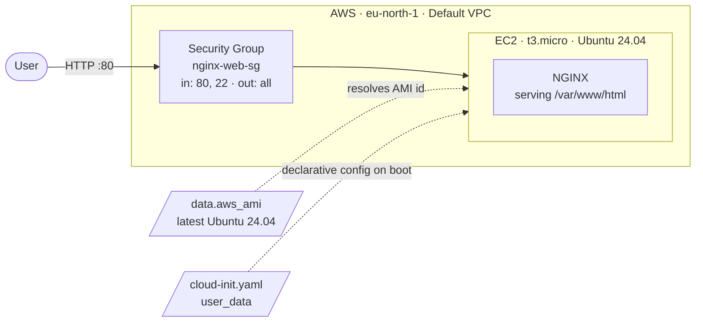

# Project 2: EC2 Deployment with Cloud-Init

Deploys an NGINX web server on AWS that comes online fully configured, serving a custom page, with
no manual steps after `terraform apply`.

The point of this project is the contrast with [project 1](../assignment-1-wordpress/). That one
bootstrapped a server with an imperative bash script and hit a race condition that silently broke
the whole deploy. This one does the same class of work declaratively with a cloud-init YAML file,
and the race condition doesn't exist.

**Result:** a custom NGINX page live at `http://<public-ip>`.

---

## What I built

- **EC2 instance** (`t3.micro`, Ubuntu 24.04 LTS) running NGINX
- **Security group** allowing HTTP (80) and SSH (22) inbound, all traffic outbound
- **Dynamic AMI lookup** for the latest Canonical Ubuntu 24.04 image
- **cloud-init YAML** (`cloud-init.yaml`) passed through `user_data`, which installs NGINX, writes
  a custom `index.html`, and enables the service on boot
- **Output** with a click-ready URL

### Architecture



---

## How Terraform passes cloud-init to the instance

This is the part the assignment is really about, so it's worth being precise.

```hcl
resource "aws_instance" "nginx_server" {
  ami             = data.aws_ami.ubuntu.id
  instance_type   = var.instance_type
  security_groups = [aws_security_group.nginx_sg.name]

  user_data = file("${path.module}/cloud-init.yaml")
}
```

`file()` reads the YAML off disk at plan time and hands the raw string to the `user_data` argument.
AWS stores it as instance metadata. On first boot, cloud-init (which ships preinstalled on the
Ubuntu AMI) fetches that metadata, sees the `#cloud-config` header on line 1, and parses the rest
as configuration rather than executing it as a script.

That `#cloud-config` shebang-style line is what switches cloud-init from "run this as bash" to
"read this as declarative config". Without it, cloud-init would try to execute the YAML as a shell
script and fail.

### user_data vs user_data_base64

I used plain `user_data`. Terraform base64-encodes it for the API automatically, so
`user_data_base64` is only needed when the content is already binary or gzip-compressed, for
example a large script you've compressed to fit inside the 16 KB user_data limit. For readable
YAML, plain `user_data` is correct and keeps the content greppable in `terraform plan` output.

---

## How the cloud-init file works

```yaml
#cloud-config

package_update: true
package_upgrade: true

packages:
  - nginx

write_files:
  - path: /var/www/html/index.html
    permissions: '0644'
    owner: www-data:www-data
    content: |
      <!DOCTYPE html>
      ...

runcmd:
  - systemctl enable nginx
  - systemctl start nginx
```

| Directive | What it does |
|-----------|--------------|
| `package_update` | Runs `apt update` before installing, so package indexes aren't stale |
| `package_upgrade` | Applies available upgrades on first boot |
| `packages` | Installs NGINX through cloud-init's own package module |
| `write_files` | Writes the custom `index.html` with explicit permissions and owner |
| `runcmd` | Enables and starts the service |

**The `packages` module is the whole story here.** In project 1 my bash script raced
`unattended-upgrades` for the dpkg lock, lost, and skipped the entire install. Cloud-init's package
module is the same code path Ubuntu's own boot process uses, so it handles the locking and ordering
internally. There is no race to lose. The defensive `while fuser /var/lib/dpkg/lock-frontend` loop I
needed in project 1 has no equivalent here because the problem doesn't arise.

**Module ordering is not file ordering.** `write_files` runs during cloud-init's init stage, which
is *before* `packages` installs NGINX in the config stage. So the custom `index.html` is written to
a directory NGINX doesn't own yet. This works for two reasons: cloud-init creates missing parent
directories, and `www-data` already exists as a system user on the base Ubuntu image before NGINX
is installed. It's worth knowing this is ordering-dependent rather than assuming YAML runs top to
bottom.

**No cleanup step needed.** In project 1 I had to `rm /var/www/html/index.html` because Apache's
default page was winning over WordPress. NGINX's default site config lists `index.html` ahead of
`index.nginx-debian.html`, so my custom page takes precedence with no cleanup at all.

**`runcmd` here is belt and braces.** The Debian and Ubuntu NGINX package already enables and starts
the service on install, so these two lines are technically redundant. I kept them because they make
the intent explicit and cost nothing.

---

## Code structure

| File | Responsibility |
|------|----------------|
| `provider.tf` | AWS provider, pinned to `6.55.0`, region from a variable |
| `main.tf` | AMI data source, security group, EC2 instance |
| `variables.tf` | Inputs: `aws_region`, `instance_type` |
| `outputs.tf` | The site URL |
| `cloud-init.yaml` | All instance configuration, declarative |
| `.terraform.lock.hcl` | Locks provider hashes for reproducible `init` |

Same layout as project 1, deliberately. The only structural difference is that the bootstrap logic
lives in YAML instead of bash, and it's noticeably shorter: 29 lines against 48, doing a comparable
job with no defensive code.

### The AMI filter changed for 24.04

```hcl
values = ["ubuntu/images/hvm-ssd-gp3/ubuntu-noble-24.04-amd64-server-*"]
```

Project 1 used `hvm-ssd/ubuntu-focal-20.04`. Canonical moved to gp3 root volumes for 24.04, so the
path segment is `hvm-ssd-gp3`, not `hvm-ssd`. Copying the 20.04 filter across and only changing the
release name returns zero AMIs and the plan fails.

---

## Deploying it

```bash
cd assignment-2-cloudinit

terraform init
terraform plan      # 2 resources to add
terraform apply
```

Wait 2 to 3 minutes after apply. As in project 1, Terraform returns as soon as the instance is
running, while cloud-init is still working. `package_upgrade: true` makes this slower than a bare
install, since it patches the whole system before touching NGINX.

```bash
terraform output nginx_url
terraform destroy
```

### Verifying cloud-init actually finished

Via EC2 Instance Connect:

```bash
cloud-init status --long          # 'status: done' means all modules completed
sudo cat /var/log/cloud-init-output.log
systemctl status nginx
```

`cloud-init status` is the check I didn't have in project 1. It gives a definitive answer about
whether configuration finished, instead of inferring it from whether the site loads.

---

## Screenshots

### 1. terraform init

<!-- paste screenshot 1 here -->

Provider downloaded and the backend initialised. The pinned `6.55.0` version resolves from
`.terraform.lock.hcl`, so this pulls the identical provider build as project 1.

### 2. terraform plan

<!-- paste screenshot 2 here -->

Two resources: the security group and the instance. The AMI ID is already resolved here, because
the `aws_ami` data source runs at plan time rather than apply time.

### 3. terraform apply, with the output URL

<!-- paste screenshot 3 here -->

Apply completes and returns `nginx_url`, built from the instance's public IP in `outputs.tf`. The
instance is running at this point, but cloud-init is still installing in the background.

### 4. The custom NGINX page

<!-- paste screenshot 4 here -->

The payoff, and the one screenshot that proves the whole chain. This page was never uploaded
anywhere. It was written by the `write_files` block in `cloud-init.yaml`, embedded into the
instance's user_data by Terraform, and rendered onto disk by cloud-init on first boot. NGINX
serving it means the install, the file write and the service enable all completed unattended.

### 5. terraform destroy

<!-- paste screenshot 5 here -->

Both resources removed cleanly, closing the lifecycle. The same state file that built the
infrastructure knows how to take all of it back down.

---

## What I learnt

**Declarative beats imperative for boot configuration.** This is the real lesson of doing project 1
first. My bash script had to explicitly wait for the apt lock, set `DEBIAN_FRONTEND`, and check
directories existed, and it still broke. Cloud-init's `packages` module does the same install with
none of that, because it hooks into the boot process properly instead of racing it. I describe the
end state and cloud-init works out how to reach it.

**Declarative code has less room to be wrong.** 29 lines of YAML against 48 lines of bash, and the
YAML has no error handling because it doesn't need any. Most of my bash was defending against
failure modes cloud-init handles internally.

**`#cloud-config` is load-bearing.** That single first line is what makes cloud-init parse the file
as config instead of executing it as a script. Same `user_data` field, same delivery mechanism,
completely different behaviour based on one line.

**Cloud-init modules run in a fixed stage order, not file order.** `write_files` runs before
`packages`, regardless of where they sit in the YAML. That's why my `index.html` lands before NGINX
is even installed. Reading YAML as a sequence of steps is a mistake.

**`cloud-init status` closes the gap Terraform leaves open.** Project 1 taught me that "instance
running" is not "application ready". This project gave me the actual tool to check the difference,
rather than refreshing a browser and guessing.

**The same tool solves both problems, at different levels.** Terraform provisions the box, cloud-init
configures what's on it. Project 1 blurred that line by stuffing configuration management into a
bash script. Keeping them separate is why this project is shorter and didn't break.

---

## Issues I hit and how I fixed them

This one worked first time, which after project 1 was not what I expected.

That is the result worth reporting, though, because it isn't luck. Project 1 failed because my bash
script raced `unattended-upgrades` for the dpkg lock, lost, and skipped the entire install without
stopping. Every defensive line I added afterwards, the lock-wait loop, `DEBIAN_FRONTEND`, the
`mkdir -p`, existed to work around problems that came from running my own script alongside the boot
process instead of as part of it.

Cloud-init's `packages` module is the same code path Ubuntu itself uses to install packages during
boot. There is no lock to race, because the package work is sequenced by the thing that owns the
sequencing. The bug from project 1 cannot occur here, so there was nothing to debug.

Two things did need attention:

**The AMI filter is not the same as project 1's.** Canonical moved to gp3 root volumes for 24.04, so
the path segment is `hvm-ssd-gp3` rather than `hvm-ssd`. Reusing the 20.04 filter and only swapping
the release name matches nothing and the plan fails on an empty data source result.

**The YAML filename has to stay in sync with `file()`.** I renamed `web-config.yaml` to
`cloud-init.yaml` partway through, which means the `file("${path.module}/cloud-init.yaml")` call in
`main.tf` has to match exactly. Terraform catches this at plan time rather than letting a broken
instance boot, which is the failure I'd rather have.

---

## Known gaps and what I'd do next

1. **`security_groups` by name instead of `vpc_security_group_ids`.** The name-based argument is the
   older EC2-Classic style and works only because this lands in the default VPC. The modern form is
   `vpc_security_group_ids = [aws_security_group.nginx_sg.id]`.

2. **Port 22 is open with no `key_name` attached.** Same as project 1. Nothing can use the rule, so
   it's pure attack surface and should be removed. EC2 Instance Connect covers debugging without it.

3. **HTTP only.** No port 443 and no certificate. Fine for a static demo page, insufficient for
   anything handling real traffic.

4. **`package_upgrade: true` slows every boot.** It patches the entire system before installing
   NGINX, adding a minute or more. Good for security, bad for boot time. Production usually bakes a
   pre-patched AMI with Packer instead, so instances boot ready rather than patching on the way up.

5. **`runcmd` duplicates what the package already does.** The NGINX package enables and starts the
   service on install. Harmless, but it hides that cloud-init's `packages` module already handled it.

6. **The HTML is embedded in the YAML.** Fine for one page. Anything larger belongs in a real
   artifact fetched at boot, or baked into the image, rather than inlined in user_data, which has a
   16 KB limit.

7. **No `aws_eip`, no state backend.** Same as project 1. The public IP changes if the instance
   stops, and state is a local file.
